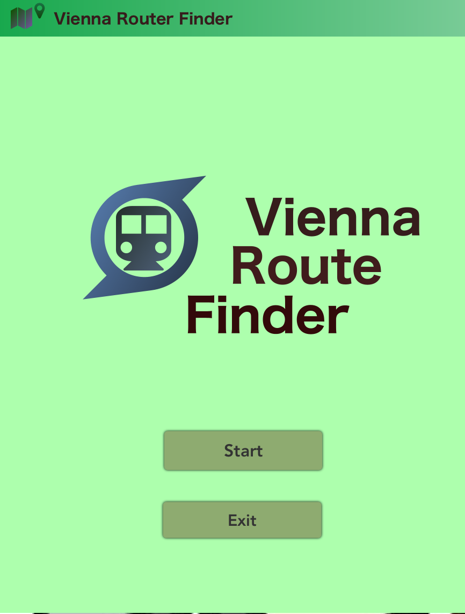

# 🚇 Vienna Subway Route Finder

A **JavaFX-based subway route finder** for the Vienna metro system, built with **IntelliJ IDEA** and **SceneBuilder**.  
This application allows users to search and visualize the fastest routes between subway stations, powered by **Dijkstra's algorithm**.

🔗 [GitHub Repository](https://github.com/sunzhengchew/RouteFinder)

---

## ✨ Features

- **Search Routes**  
  - Find routes between two stations 
  - Stay Avoid and Way point functions are available✅
  - Display travel path and estimated duration  

- **Interactive UI**  
  - Built with JavaFX and SceneBuilder  
  - User-friendly station selection  

- **Subway Data Management**  
  - Predefined Vienna subway stations and connections  
  - Handles line changes and multiple routes   

---

## 🛠️ Tech Stack

- **Language:** Java, CSS  
- **GUI Framework:** JavaFX  
- **UI Design:** SceneBuilder  
- **IDE:** IntelliJ IDEA  

---

## 🚀 Installation & Setup

1. Clone the repository:
   ```bash
   git clone https://github.com/sunzhengchew/RouteFinder
   cd RouteFinder

## 📸 Screenshots
### Start Page

### Select Station Page

### Result Page


